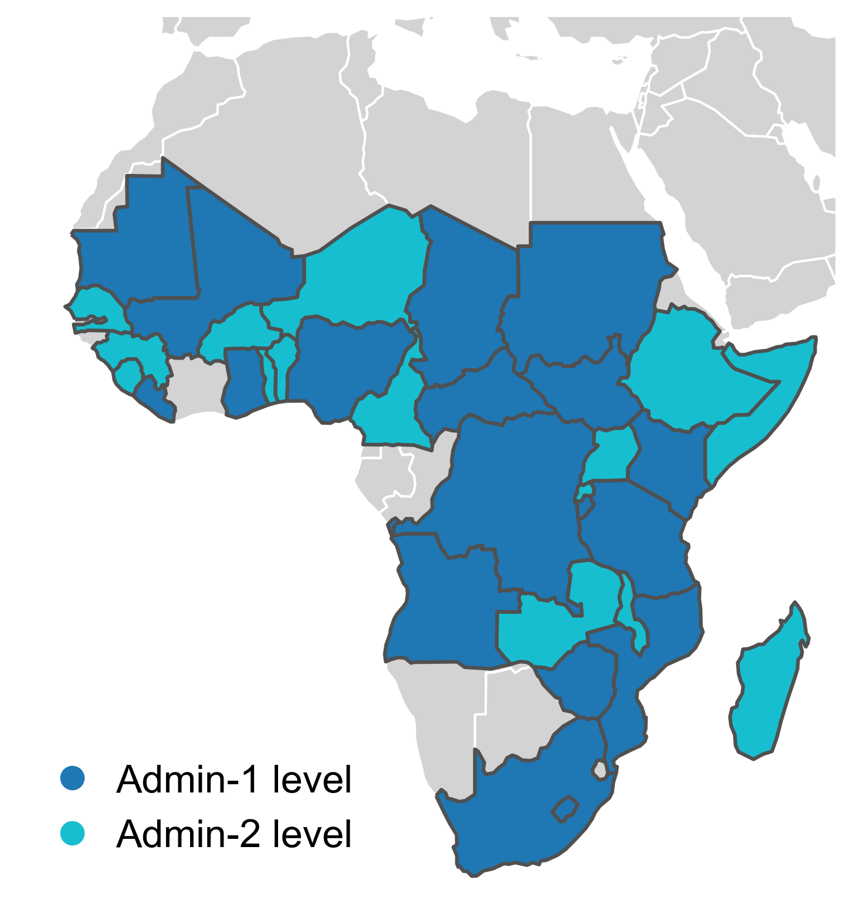

# HarvestStat-Africa UI: Interactive Data Visualization Interface


<!-- 
 -->

## Overview

This is a **web-based user interface (UI)** for the HarvestStat-Africa dataset - a comprehensive repository of cleaned and harmonized subnational crop production data for Africa. The UI provides an interactive platform for visualizing and exploring crop statistics from various sources, including the Famine [Early Warning Systems Network (FEWS NET)](https://fews.net/) and the Food and Agriculture Organization (FAO).

The application consists of:
- **Frontend**: A React-based web interface for data visualization and exploration
- **Backend**: A Flask API server that processes and serves the crop statistics data

This UI enables researchers, policymakers, and stakeholders to interactively explore trends and patterns from the subnational to the global level, facilitating better-informed decisions related to food security, trade, and development.

## Quick Start

### Prerequisites
- **Node.js** (version 14 or higher) and **npm**
- **Python** (version 3.7 or higher) and **pip**

### Running the Application

1. **Clone the repository:**
   ```bash
   git clone https://github.com/HarvestStat/HarvestStat-Africa.git
   cd HarvestStat-Africa
   ```

2. **Start the Backend (Flask API):**
   ```bash
   cd backend
   pip install -r requirements.txt
   python app.py
   ```
   The backend will start on `http://127.0.0.1:5000`

3. **Start the Frontend (React UI):**
   ```bash
   # Open a new terminal window/tab
   cd frontend
   npm install
   npm start
   ```
   The frontend will start on `http://localhost:3000` and automatically open in your browser

4. **Access the Application:**
   Open your web browser and navigate to `http://localhost:3000` to use the HarvestStat-Africa UI

### Development Mode
The application runs in development mode by default, which includes:
- Hot reloading for both frontend and backend changes
- Detailed error messages and debugging information
- Automatic browser refresh when code changes are detected

## Data sources
The data in this repository is compiled from various sources, including:
- Famine Early Warning Systems Network (FEWS NET) of the United States Agency for International Development (USAID). This is the primary source of information
    - [FEWS NET Data Warehouse (FDW)](https://fews.net/data)
- Food and Agriculture Organization (FAO)
    - [FAOSTAT](https://www.fao.org/faostat/en/#home)
- National agricultural agencies

## Repository structure
This UI application is organized as follows:
- `frontend/`: React-based web interface for data visualization
  - `src/`: React components and application logic
  - `public/`: Static assets and HTML template
  - `package.json`: Node.js dependencies and scripts
- `backend/`: Flask API server for data processing
  - `app.py`: Main Flask application
  - `requirements.txt`: Python dependencies
- `docs/`: Documentation related to the data and application
- `public/`: Processed datasets in CSV, Parquet, and GeoPackage formats

## Alternative Setup (Development Environment)
For a more detailed development setup:

1. **Backend Setup:**
   ```bash
   cd backend
   # Create virtual environment (optional but recommended)
   python -m venv venv
   source venv/bin/activate  # On Windows: venv\Scripts\activate
   pip install -r requirements.txt
   ```

2. **Frontend Setup:**
   ```bash
   cd frontend
   npm install
   ```

3. **Running in Development Mode:**
   - Start backend: `python backend/app.py`
   - Start frontend: `npm start` (from frontend directory)

## Troubleshooting
- **Port conflicts:** If port 3000 or 5000 are in use, the applications will prompt to use alternative ports
- **Node.js issues:** Ensure you have Node.js version 14 or higher installed
- **Python issues:** Ensure you have Python 3.7 or higher installed

## Current data status
HarvetStat currently contains subnational crop statistics for **`33`** countries.
<!-- (see [current data status per country](/docs/data_status_per_country.md)):</br> -->
- Admin-1 level: Angola, Burundi, Central African Republic, Chad, DRC, Ghana, Kenya, Lesotho, Liberia, Mali, Mauritania, Mozambique, Nigeria, South Africa, South Sudan, Sudan, Tanzania, Zimbabwe
- Admin-2 level: Benin, Burkina Faso, Cameroon, Ethiopia, Guinea, Madagascar, Malawi, Niger, Rwanda, Senegal, Sierra Leone, Somalia, Togo, Uganda, Zambia



## Data access
The data in this repository is available in the `public` folder in CSV and GeoPackage formats.

To access the data, download the files from the `public` folder.
- hvstat_africa_data_{version}.csv: The final processed crop statistics dataset.
- hvstat_africa_boundary_{version}.gpkg: Boundary data for subnational administrative units.

The version of the dataset is specified in the filename. The current version is `v1.0`.

The official release version is available on [Dryad - HarvestStat Africa](https://datadryad.org/dataset/doi:10.5061/dryad.vq83bk42w).

## Data structure
The dataset contains the following columns:

| Column Name             | Description                                                     |
| ----------------------- | --------------------------------------------------------------- |
| `fnid`                  | FEWS NET's unique geographic unit identifier                    |
| `country`               | Name of the country                                             |
| `country_code`          | ISO 3166-1 alpha-2 country code                                 |
| `admin_1`               | Name of the first-level administrative unit                     |
| `admin_2`               | Name of the second-level administrative unit (if applicable)    |
| `product`               | Name of the crop product                                        |
| `season_name`           | Name of the growing season                                      |
| `planting_year`         | Year when planting begins                                       |
| `planting_month`        | Month when planting begins                                      |
| `harvest_year`          | Year when harvesting ends                                       |
| `harvest_month`         | Month when harvesting ends                                      |
| `crop_production_system`| Type of crop production system (e.g., irrigated, rainfed, etc.) |
| `qc_flag`               | Quality control flag (0 = no flag, 1 = outlier, 2 = low variance)|
| `area`                  | Cropped area (hectares; ha)                                     |
| `production`            | Crop quantity produced (metric tonnes; mt)                      |
| `yield`                 | Crop yield (metric tonnes per hectare; mt/ha)                   |

For details, please see the paper in the [Citation](#citation) section.

## Citation
The data in this repository is available for free and unrestricted use. Users are encouraged to cite the following:

D. Lee, W. Anderson, X. Chen, F. Davenport, S. Shukla, R. Sahajpale, M. Budde, J. Rowland, J. Verdin, L. You, M. Ahouangbenoni, K. Davis, E. Kebede, S. Ehrmannk, C. Justice, and C. Meyer. (2024), HarvestStat Africa – Harmonized Subnational Crop Statistics for Sub-Saharan Africa. EarthArXiv, [https://doi.org/10.31223/X5M123](https://doi.org/10.31223/X5M123).

<details>
<summary>BibTeX</summary>
<pre>
@article{lee_eaxv2024,
  author       = {Lee, Donghoon and
                  Anderson, Weston and
                  Chen, Xuan and
                  Davenport, Frank and
                  Shukla, Shraddhanand and
                  Sahajpal, Ritvik and
                  Budde, Michael and
                  Rowland, James and
                  Verdin, Jim and
                  You, Liangzhi and
                  Ahouangbenon, Matthieu and
                  Davis, Kyle Frankel and
                  Kebede, Endalkachew and
                  Ehrmann, Steffen and
                  Justice, Christina and
                  Meyer, Carsten},
  title        = {{HarvestStat Africa – Harmonized Subnational Crop Statistics for Sub-Saharan Africa}},
  year         = {2024},
  journal      = {EarthArXiv},
  note         = {Preprint},
  doi          = {10.31223/X5M123},
  url          = {https://doi.org/10.31223/X5M123}
}
</pre>
</details>

## How to contribute
Contributions to this repository are welcome, including new data sources or improvements to the existing data. To contribute, please create a pull request with a clear description of the changes proposed.

## Contact 
- Please contact Donghoon Lee ([Donghoon.Lee@umanitoba.ca](Donghoon.Lee@umanitoba.ca) and Weston Anderson [Weston@umd.edu](Weston@umd.edu)) for any questions or collaborations.</br>
- Users are encouraged to [open an issue](https://github.com/HarvestStat/HarvestStat/issues) for questions, feedback, or bug reports.

## License
The data in this repository is licensed under the MIT License.